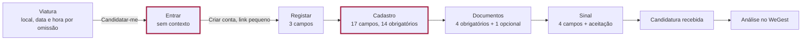

# UX/UI dos fluxos: diagnóstico (fase 1)

Execução da fase 1 de `PROMPT-MASTER-UX-UI.md`, 07/10/2026, sobre a versão 0.3.0
(direção de design já aplicada). Nenhum ficheiro da aplicação foi alterado.

**Método.** Percurso automático em Chrome (DevTools Protocol) dos dois funis até ao
fim, como cliente novo, em 375 e 1280 px; depois, com a conta de demonstração, a
candidatura e a reserva levadas a todos os estados pelo `/admin`. Em cada passo:
captura, campos, posição do total e do botão principal, foco após erro, alertas
anunciados. Capturas em `docs/design/ux-shots/` (folhas de contacto
`folha-mobile-1.jpg` e `folha-mobile-2.jpg`). Revisão de código para os estados que
não se provocam pela interface. Skills: `design:design-critique`,
`design:accessibility-review`, `design:ux-copy`.

**Resumo.** Os dois funis chegam ao fim e respeitam as regras de negócio (preço
da API, nova verificação de disponibilidade, pagamento separado da aprovação,
reserva "a aguardar confirmação"). Os problemas estão em quatro sítios: o total
desaparece do checkout em mobile depois do primeiro passo; a área de cliente tem
scroll horizontal em mobile; três estados terminam sem saída (sessão expirada,
viatura indisponível no último passo, Multibanco sem referência); e o TVDE pede
conta antes de explicar porquê.

---

## A. Funis

### Rent a Car (mobile, cliente novo)

```mermaid
flowchart LR
  H[Homepage] -->|1 toque| P[Pesquisa<br/>6 campos com valores por omissão]
  P -->|Pesquisar| R[Resultados<br/>9 viaturas]
  R -->|toque no card| V[Viatura<br/>total e Reservar visíveis]
  V -->|Reservar| E[Proteção e extras<br/>3 coberturas + 7 extras]
  E -->|Continuar| D[Dados<br/>14 campos, 9 obrigatórios + password]
  D -->|Continuar| G[Pagamento<br/>4 campos + termos]
  G -->|Pagar e reservar| C[Pedido recebido<br/>aguarda confirmação]
  P:::atrito
  E:::atrito
  D:::atrito
  classDef atrito stroke:#9f1239,stroke-width:3px
```

| Passo | Medido em 375 px | O que pode fazer desistir | Evento §106 (onde disparar) |
|---|---|---|---|
| Homepage | Botão "Pesquisar" a 1604 px (dois ecrãs abaixo) | A pesquisa só aparece depois dos dois cards de serviço | `rentacar_search` (submit do formulário) |
| Resultados | 9 cards, filtros num botão | Nenhum atrito relevante | `rentacar_results` (render com resultados; também resultados vazios) |
| Viatura | Total e "Reservar" no primeiro ecrã | | `rentacar_vehicle_view` |
| Proteção e extras | Página com 3424 px; "Continuar" a 2444 px; o total só aparece no fim da lista | Não ver quanto custa enquanto escolhe | `rentacar_extra_added` (cada extra) |
| Dados | 14 campos (9 obrigatórios) + password; o total deixa de aparecer | Pedido de conta e carta de condução antes de pagar; sem total à vista | `rentacar_checkout_started` (entrada no passo), `rentacar_customer_created` (resposta da API) |
| Pagamento | 4 campos + termos; total só no texto do botão | | `rentacar_payment_started`, `rentacar_payment_completed` |
| Confirmação | Estado "Aguarda confirmação" | | `rentacar_booking_completed` |

### TVDE (mobile, motorista novo)

| Passo | Medido | O que pode fazer desistir | Evento §106 |
|---|---|---|---|
| Viatura | Preço, caução, sinal e km no primeiro ecrã; disponibilidade confirmada ao mudar data ou local | | `tvde_vehicle_view`, `tvde_pickup_selected` |
| Entrar | Página genérica "Entrar", com a conta de demonstração no topo; "Criar conta" é um link pequeno à direita | Um motorista novo não sabe que tem de criar conta nem que a escolha fica guardada | `tvde_registration_started` (registo com `next` de candidatura) |
| Cadastro | 17 campos, 14 obrigatórios; o nome e o email vêm do registo | Formulário longo sem indicação do que vem a seguir | `tvde_application_started` (resposta da API) |
| Documentos | 4 obrigatórios; o botão de continuar só aparece no fim | Não ter os documentos à mão (não foram pedidos antes) | `tvde_document_uploaded` (cada envio) |
| Sinal | Aviso de aprovação condicionada + aceitação obrigatória | | `tvde_payment_started`, `tvde_payment_completed` |
| Confirmação | Linha temporal e estado "Submetida" | | `tvde_application_submitted` |
| Análise | Estados no portal | | `tvde_application_approved` / `_rejected` (quando o portal lê o novo estado) |

Nenhum evento está implementado hoje. Proposta: helper `track(nome, dados)` sem
envio até haver fornecedor, com os nomes exatos do §106.

---

## B. Diagnóstico por fluxo

### Rent a Car

| Achado | Severidade | Recomendação |
|---|---|---|
| No checkout em mobile, o resumo e o total só aparecem no passo 1, depois da lista de extras; nos passos 2 e 3 desaparecem (o total só existe no texto do botão "Pagar") | 🔴 Crítico | Barra fixa no fundo em mobile com total e botão do passo, que abre o resumo completo |
| Homepage em mobile: a pesquisa está a 1604 px | 🟡 | Pesquisa logo a seguir ao título em mobile; os dois cards de serviço depois |
| Datas por omissão (amanhã às 10:00, mais 3 dias) fazem sentido para turismo | ✅ | Manter |
| Resultados: o total do período e o preço por dia distinguem-se (direção A) | ✅ | Manter |
| "Indisponível até 24/10" explica-se sozinho | ✅ | Manter |
| A conta é obrigatória e pedida a meio dos dados, sem explicar o benefício até ao fim do formulário | 🟡 | Primeiro bloco do passo 2: "Já tem conta? Entrar" ao lado de "Continuar como novo cliente", e explicar que a conta serve para acompanhar a reserva |
| Sair para "Entrar" a meio do checkout perde as escolhas de extras e cobertura | 🟡 | Guardar as escolhas no URL ou em `sessionStorage` antes de sair |
| Confirmação: "Pedido de reserva recebido" e "Aguarda confirmação", sem prazo inventado | ✅ | Manter |
| Confirmação: em 375 px a coluna de rótulos (10,5 rem) aperta os valores ("Leiria, 20/10/2026, 10:00" em 3 linhas) | 🟢 | Rótulo por cima do valor em mobile (passa para o prompt de posicionamento) |

### TVDE

| Achado | Severidade | Recomendação |
|---|---|---|
| "Candidatar-me" leva à página genérica "Entrar" sem dizer porquê; criar conta é um link pequeno | 🟡 | Página de entrada contextual: "Para se candidatar ao Toyota Yaris Hybrid, crie uma conta ou entre. A sua escolha fica guardada", com "Criar conta" como ação principal |
| Antes de começar, o motorista não vê a lista completa: 17 campos, 4 documentos, sinal | 🟡 | Na viatura e no início do cadastro: "Vai precisar de: Cartão de Cidadão, carta, certificado TVDE, comprovativo de morada. Leva cerca de 10 minutos." (os documentos vêm da API) |
| O aviso "o pagamento não é aprovação" está antes do botão e exige aceitação | ✅ | Manter |
| Termo do sinal muda em cada ecrã (ver E) | 🟡 | Um termo fixo |
| Linha temporal da confirmação: em 375 px os rótulos dos passos 4 e 5 sobrepõem-se ("Aprovaçãolevantamento") | 🟡 | Rótulos em duas linhas ou só o passo atual com rótulo em mobile |
| Documentos em mobile: título, descrição e botão lado a lado; o título parte em 3 linhas | 🟢 | Botão por baixo do texto em mobile |
| Pedido de documentos adicionais: claro, com o documento destacado | ✅ | Manter |
| Recusa: mostra motivo e reembolso quando há pagamento | ✅ | Manter |
| Candidatura de demonstração mostra "Pagamento" concluído na linha temporal e "Sem pagamento" na tabela | 🟢 | A linha temporal passa a ler o estado do pagamento, não só o da candidatura |

### Áreas de cliente

| Achado | Severidade | Recomendação |
|---|---|---|
| **Scroll horizontal em mobile** na candidatura (documento com 509 px num ecrã de 375): o selo de estado, a linha temporal e o botão "Substituir" ficam cortados. A grelha da área de cliente não tem colunas definidas e cresce com o conteúdo | 🔴 Crítico | `grid-cols-1` na grelha em mobile (`account-shell.tsx`). Acrescentar a área de cliente em todos os estados à verificação de layout |
| O painel mostra primeiro o que importa (próxima reserva, candidatura atual) | ✅ | Manter |
| Cancelar só aparece quando o sistema permite; depois, "contacte a nossa equipa" com o telefone (ainda "a confirmar") | ✅ | Manter |

---

## C. Estados e casos limite

| Ecrã | Estado | Existe? | O que mostra | Proposta |
|---|---|---|---|---|
| Todas as páginas com dados | Carregamento | ✅ | Skeletons com a forma do conteúdo | |
| Resultados | Vazio | ✅ | "Não há viaturas disponíveis para estas datas" + sugestão | Ligação direta para alterar datas |
| Resultados com filtros | Vazio | ✅ | "Limpar filtros" | |
| Páginas com WeGest | Erro / timeout | ✅ | `ErrorState` com "Tentar novamente" e "Contactar-nos" | |
| Pedidos do browser | Timeout | ✅ | Mensagem após 20 s (45 s no pagamento) | |
| Checkout | Sem sessão | ✅ | Criação de conta no passo 2 | |
| Checkout | **Sessão expirada a meio** (utilizador com sessão, cookie expira) | ❌ | A API responde 401 "Crie uma conta ou inicie sessão", mas o formulário já não tem o campo de password: beco sem saída | Mostrar "A sua sessão expirou" com botão "Entrar" que volta ao checkout com as escolhas guardadas |
| Checkout | Preço alterado (`PRECO_ALTERADO`) | ✅ | Novo total + mensagem | Em mobile o total não está visível no passo 3 (ver B): resolve-se com a barra fixa |
| Checkout | **Viatura indisponível no último passo** | ⚠️ | Mensagem; o pagamento é reembolsado; não há saída | Botão "Ver viaturas para as mesmas datas" |
| Checkout | Pagamento recusado | ✅ | "O pagamento foi recusado. Verifique os dados ou use outro método." | |
| Checkout | **Multibanco / MB WAY pendentes** | ❌ | A reserva é criada, mas a confirmação não mostra a referência Multibanco nem o pedido MB WAY | Bloco "Falta pagar" na confirmação com entidade/referência/valor ou "Aprove no telemóvel", e estado do pagamento no portal |
| Candidatura | Upload inválido (formato, tamanho, ficheiro falso) | ✅ | Mensagem junto ao documento | |
| Candidatura | **Reserva temporária expirada** | ❌ | Mostra "reservada até às 23:37", mas nada acontece depois dessa hora | Ao expirar: aviso e nova verificação de disponibilidade antes de pagar (confirmar com o WeGest se existe hold, gap #9) |
| Candidatura | Abandonada a meio | ✅ | O portal leva de volta aos documentos | |
| Candidatura | Recusada com reembolso | ✅ | Motivo, valor e estado do reembolso | |
| Reserva | Confirmada / concluída / cancelada | ✅ | Separadores Próximas, Anteriores, Canceladas | |

---

## D. Acessibilidade (WCAG 2.1 AA)

**Problemas:** 9 | **Críticos:** 1 | **Graves:** 4 | **Menores:** 4

| # | Problema | Critério | Severidade | Correção |
|---|---|---|---|---|
| 1 | Scroll horizontal e conteúdo cortado na área de cliente em 375 px | 1.4.10 Reflow | 🔴 | `grid-cols-1` (ver B) |
| 2 | Ao mudar de passo no checkout e na candidatura, a página faz scroll mas o foco fica no botão anterior; o leitor de ecrã não anuncia o novo passo | 2.4.3 Focus order, 4.1.3 Status messages | 🟡 | Foco no título do novo passo (`tabIndex={-1}`) |
| 3 | Drawer de filtros e menu móvel: sem Esc e sem foco preso; o foco pode sair para a página por trás | 2.1.2, 2.4.3 | 🟡 | Esc fecha, foco preso enquanto aberto, foco devolvido ao botão que abriu |
| 4 | Recotação do total anunciada (`aria-live`) só em desktop; em mobile o resumo não existe nos passos 2 e 3 | 4.1.3 | 🟡 | Resolve-se com a barra fixa com `aria-live` |
| 5 | Botões +/- dos extras com 36 x 36 px | 2.5.5 (meta do projeto: 44 px) | 🟡 | 44 x 44 px |
| 6 | Cada erro de validação é um `role="alert"`: num envio com 6 erros, o leitor anuncia 6 mensagens seguidas | 3.3.1 | 🟢 | Erros sem `role="alert"`; um único resumo anunciado ("6 campos por corrigir") e foco no primeiro (já acontece) |
| 7 | Grupo de coberturas sem `fieldset`/`legend`: o leitor anuncia "Proteção base, rádio" sem o nome do grupo | 1.3.1 | 🟢 | `fieldset` com `legend` "Proteção" |
| 8 | Linha temporal: o estado de cada passo é só visual (marca de verificação, cor) | 1.3.1 | 🟢 | Texto oculto "concluído", "atual" |
| 9 | Botão desativado "Candidatar-me" sem explicação associada | 3.3.2 | 🟢 | `aria-describedby` para a mensagem de disponibilidade |

**Já cumpre:** foco visível em todos os controlos testados (incluindo cards e
opções em cartão), foco no primeiro campo com erro, erros ligados ao campo por
`aria-describedby`, `lang="pt-PT"`, link "Saltar para o conteúdo", contrastes da
direção de design (fase anterior), alternativas de texto nas imagens.

| Elemento | Ordem de tabulação | Enter/Espaço | Esc |
|---|---|---|---|
| Pesquisa | Local, datas, horas, "Devolver no mesmo local", Pesquisar | Submete | |
| Card de viatura | Um único link por card | Abre a viatura | |
| Coberturas e métodos de pagamento | Rádios agrupados por `name` | Seleciona | |
| Drawer de filtros | Botão abre; foco não entra no drawer | | ❌ não fecha |
| Menu móvel | Botão abre/fecha | | ❌ não fecha |

---

## E. Texto de interface

| Ecrã | Atual | Proposta | Porquê |
|---|---|---|---|
| Card TVDE / viatura TVDE / resumo / passo 4 | "Paga agora (sinal)", "Sinal a pagar agora", "Pagamento agora", "Sinal da reserva" | **"Sinal (pago agora)"** em rótulos; título do passo "Pagar o sinal" | Um conceito, um nome (§45 distingue sinal de caução) |
| Card TVDE / viatura TVDE | "1500 km por semana", "1500 km/semana" | Unidade da API: **"km por mês"** (ex.: "6000 km por mês") | A API WeGest devolve `km_incluidos` por mês no TVDE |
| Passo 1 do checkout | Etiqueta do passo "Extras" | "Proteção e extras" | O passo começa pela proteção |
| Erros de email e telefone vazios | "Email inválido.", "Telefone inválido." | "Indique o email.", "Indique o telefone." (inválido só quando há texto) | O campo vazio não é inválido; diz o que fazer |
| Formulário dinâmico TVDE | "Campo obrigatório." | "Indique {rótulo em minúsculas}." | Diz qual o campo e o que fazer |
| Entrar a partir do TVDE | "Entrar / Aceda à sua área de cliente." | "Crie a sua conta para se candidatar. A sua escolha de viatura fica guardada." | Contexto e benefício |
| Botão TVDE no passo 4 | "Pagar 200 € e submeter" | "Pagar 200 € e enviar candidatura" | "Submeter" é jargão; diz o que acontece |
| Viatura indisponível no último passo | "A viatura deixou de estar disponível. O valor pago será devolvido." | "Esta viatura acabou de ser reservada por outra pessoa. Não foi cobrado nada" (ou "o valor foi devolvido", conforme o pagamento) + "Ver viaturas para as mesmas datas" | O que aconteceu, o que muda para a pessoa, próximo passo |
| Sessão expirada | "Crie uma conta ou inicie sessão para reservar." | "A sua sessão terminou. Entre novamente para concluir a reserva; as suas escolhas ficam guardadas." | Explica a causa |

**Glossário fixo** (para o site e, mais tarde, emails e WeGest):

| Termo | Uso | Não usar |
|---|---|---|
| Reserva | Rent a Car, antes e depois de confirmada | Pedido (exceto "pedido de reserva recebido") |
| Candidatura | TVDE | Inscrição, processo |
| Levantamento / devolução | Local, data e hora | Recolha, entrega (só nos campos da API) |
| Sinal (pago agora) | Valor pago no checkout TVDE | Pagamento agora, reserva |
| Caução | Valor de garantia | Depósito |
| Por dia / por semana / por mês | Unidade sempre por extenso nos preços | "/dia" isolado em texto corrido |
| Proteção | Coberturas de seguro | Seguro extra |
| Aguarda confirmação | Reserva pendente | Pendente |

---

## Lista priorizada

| # | Item | Tipo | Ficheiros | Esforço |
|---|---|---|---|---|
| 1 | Área de cliente sem scroll horizontal em mobile (`grid-cols-1`) | rápido | `account/account-shell.tsx` | P |
| 2 | Checkout em mobile: barra fixa com total e botão do passo, com `aria-live`, que abre o resumo | estrutural | `booking/booking-wizard.tsx`, `booking/booking-summary.tsx` | M |
| 3 | Confirmação com pagamento pendente: referência Multibanco ou pedido MB WAY, e estado no portal | estrutural | `payments/*`, `rent-a-car/confirmacao`, `minha-conta/reservas/[id]` | M |
| 4 | Sessão expirada no checkout: mensagem e "Entrar" que volta com as escolhas guardadas | estrutural | `booking-wizard.tsx`, `api/rentacar/bookings` | M |
| 5 | Viatura indisponível no último passo: texto claro e "Ver viaturas para as mesmas datas" | rápido | `booking-wizard.tsx` | P |
| 6 | Foco no título ao mudar de passo (checkout e candidatura) | rápido | `booking-wizard.tsx`, `tvde/application-layout.tsx` | P |
| 7 | Drawer de filtros e menu móvel: Esc, foco preso, foco devolvido | rápido | `vehicles/vehicle-results.tsx`, `layout/mobile-menu.tsx` | P |
| 8 | Entrada contextual no TVDE: criar conta como ação principal, explicação e escolha guardada | estrutural | `entrar`, `registar`, `account/auth-forms.tsx` | M |
| 9 | "Vai precisar de" (documentos e tempo) na viatura TVDE e no início do cadastro | rápido | `tvde/viatura/[slug]`, `tvde/candidatura` | P |
| 10 | Glossário aplicado: sinal, km por mês, "Proteção e extras", "enviar candidatura" | rápido | cards, resumos, passos | P |
| 11 | Mensagens de erro: vazio vs. inválido; "Indique {campo}"; resumo único de erros anunciado | rápido | `lib/validation.ts`, `lib/dynamic-form.ts`, `shared/form.tsx` | P |
| 12 | Homepage em mobile: pesquisa logo a seguir ao título | rápido | `app/[region]/page.tsx` | P |
| 13 | Linha temporal TVDE: rótulos sem sobreposição em mobile, estado em texto para leitores de ecrã, passo "Pagamento" a partir do pagamento real | rápido | `tvde/application-status.tsx` | P |
| 14 | Extras: botões +/- com 44 px; coberturas em `fieldset`/`legend` | rápido | `booking-wizard.tsx` | P |
| 15 | Eventos de analytics do §106 com helper `track()` sem envio | estrutural | `lib/analytics.ts` + pontos da tabela A | M |

Ordem sugerida: 1, 2 e 6 (mobile e acessibilidade), depois 5, 4, 3 (estados sem
saída), depois 8 a 14, por fim 15.

**Encaminhado para o prompt de posicionamento:** coluna de rótulos apertada na
confirmação em 375 px, documentos em mobile com botão ao lado do texto, seletor de
ordenação cortado. A verificação de layout deve incluir a área de cliente em todos
os estados (o problema 1 não aparecia no estado "em análise").

---

## F. Por confirmar com o cliente

- Pagamento no checkout Rent a Car, sabendo que a reserva entra pendente: cobrar e
  reembolsar se a equipa recusar, pré-autorização, ou sem pagamento online na v1.
  Afeta o item 3.
- Métodos de pagamento a oferecer (cartão, MB WAY, Multibanco).
- Candidatura TVDE enquanto o WeGest não tem a fase de candidaturas.
- Conta obrigatória para reservar Rent a Car, ou reserva como convidado.
- Textos de política em falta: documentos no levantamento, requisitos TVDE (idade,
  anos de carta, certificado), cancelamento depois de confirmada.
- Fornecedor de analytics (item 15).

---

**Aprovas a lista, ou queres cortar ou reordenar?**
